# Chapter 4 - Mermaid Diagrams
## Smart Crop Prediction System - Analysis Modeling

Copy these mermaid scripts to render diagrams in Markdown, GitHub, or [Mermaid Live Editor](https://mermaid.live/)

---

## 4.1 DATA MODELING - Entity Relationship Diagram

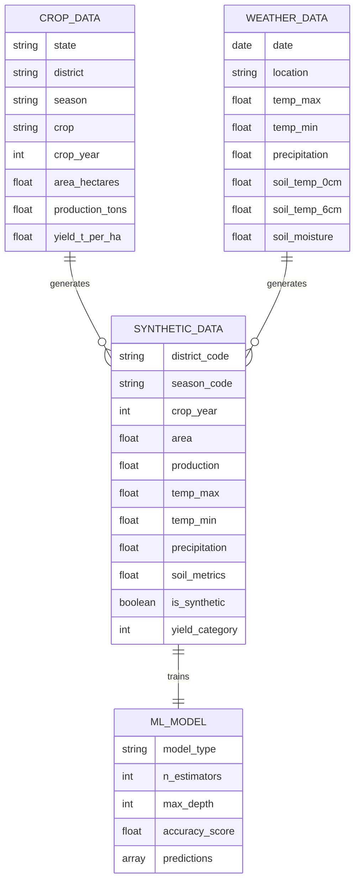

---

## 4.2 ACTIVITY DIAGRAM - System Workflow

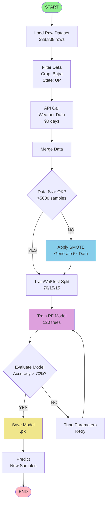

---

## 4.2 CLASS DIAGRAM - System Components

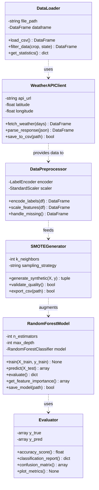

---

## 4.3 FUNCTIONAL MODELING - Use Case Diagram

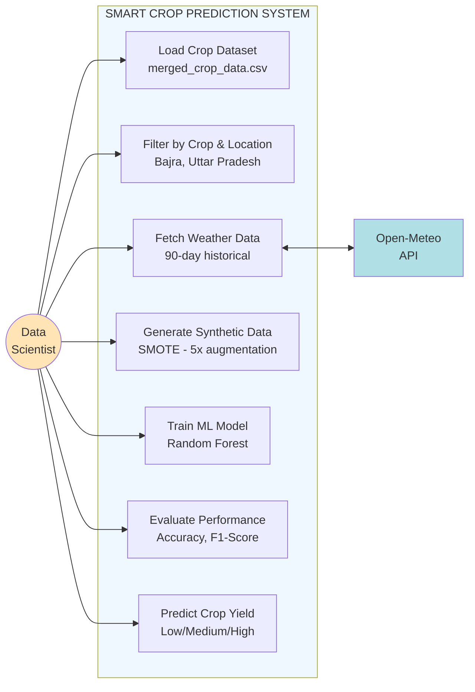

---

## 4.3 FUNCTIONAL MODULES - Module Hierarchy

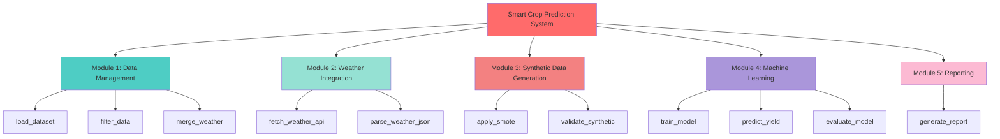

---

## 4.4 TIMELINE CHART - Gantt Chart

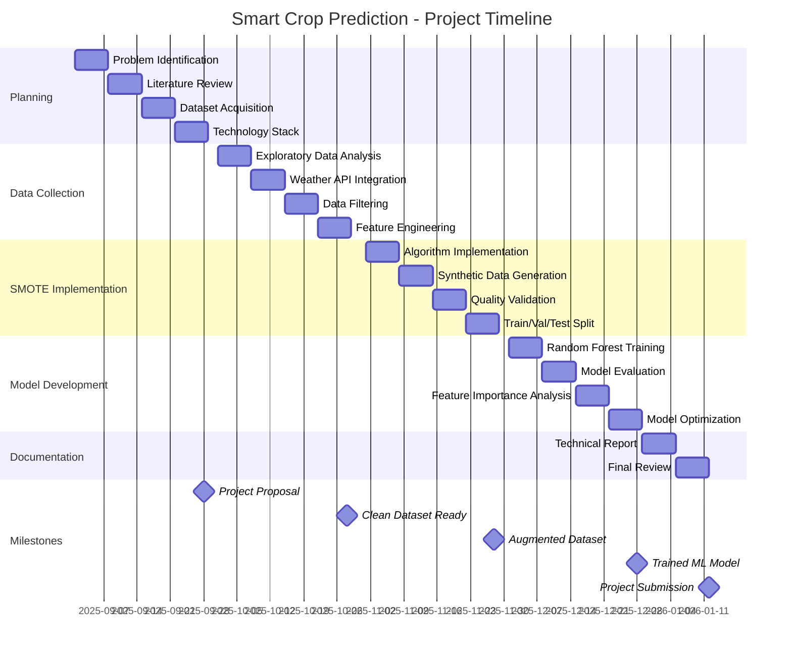

---

## 4.4 DELIVERABLES TIMELINE - Simplified View

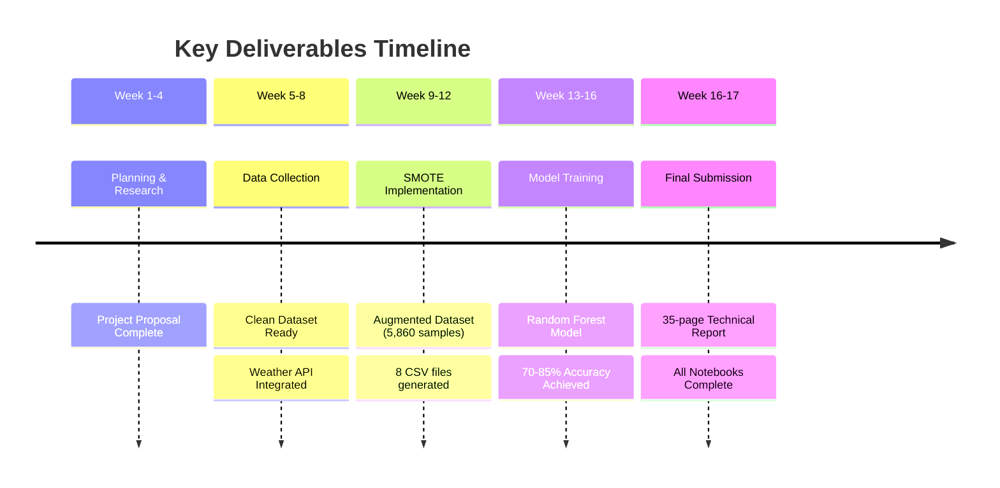

---

## 4.4 CRITICAL PATH DIAGRAM

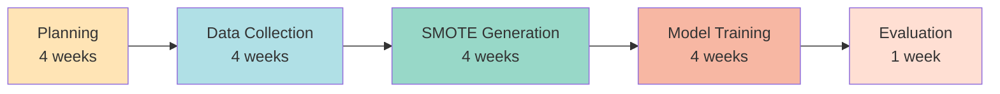

---

## RESOURCE ALLOCATION PIE CHART

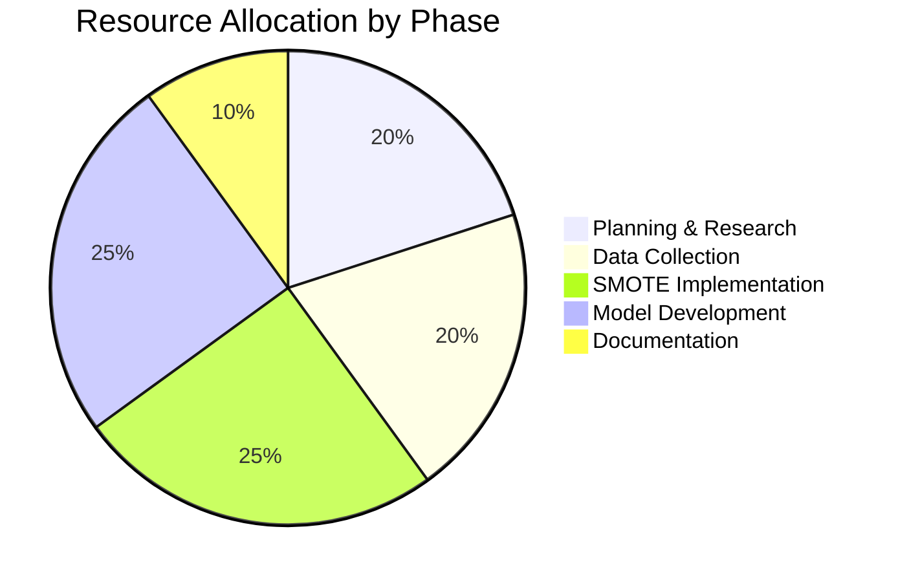

---

## DATA FLOW SEQUENCE DIAGRAM

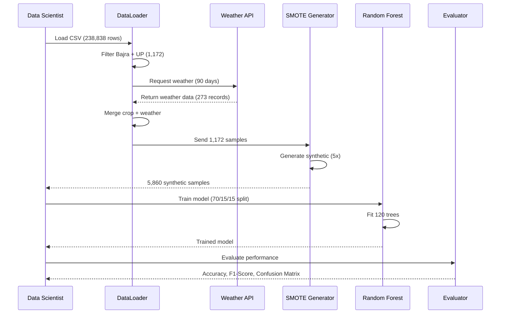

---

## DECISION TREE - Technology Selection

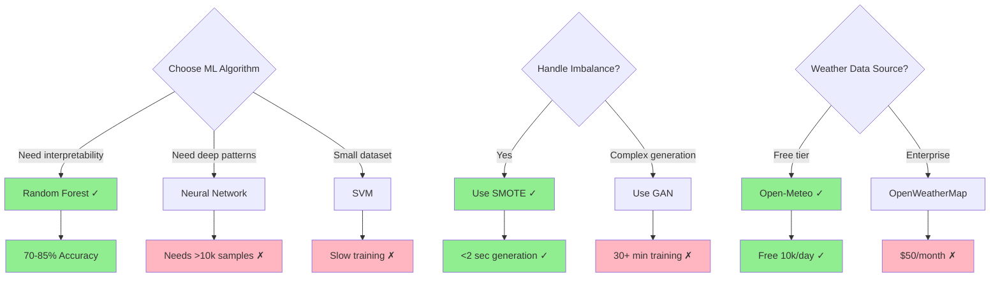

---

## SYSTEM STATE DIAGRAM

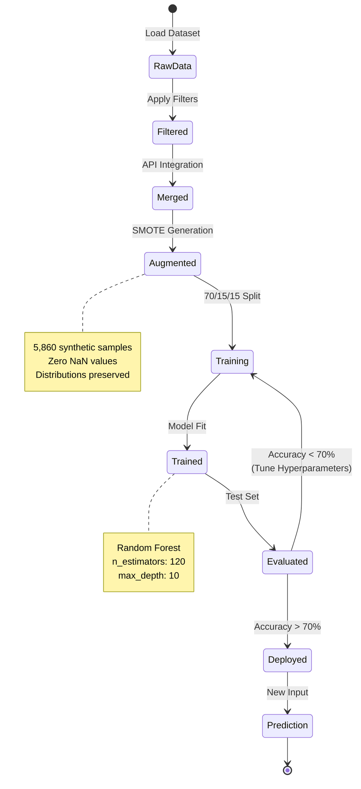

---

## IMPLEMENTATION PHASES - SWIM LANE DIAGRAM

```mermaid
graph TB
    subgraph "Phase 1: Data Preparation"
        A1[Load Data] --> A2[EDA]
        A2 --> A3[Filter & Clean]
        A3 --> A4[Weather API]
    end
    
    subgraph "Phase 2: Augmentation"
        B1[Configure SMOTE] --> B2[Generate 5x Data]
        B2 --> B3[Validate Quality]
        B3 --> B4[Export CSVs]
    end
    
    subgraph "Phase 3: Model Training"
        C1[Split Data] --> C2[Train RF]
        C2 --> C3[Predict Test]
        C3 --> C4[Evaluate Metrics]
    end
    
    subgraph "Phase 4: Deployment"
        D1[Save Model] --> D2[Documentation]
        D2 --> D3[Testing]
        D3 --> D4[Production Ready]
    end
    
    A4 --> B1
    B4 --> C1
    C4 --> D1
    
    style "Phase 1: Data Preparation" fill:#E3F2FD
    style "Phase 2: Augmentation" fill:#FFF3E0
    style "Phase 3: Model Training" fill:#F3E5F5
    style "Phase 4: Deployment" fill:#E8F5E9
```

---

## Usage Instructions

### Rendering Options:

1. **GitHub/GitLab**: Paste directly in `.md` files
2. **Mermaid Live**: [https://mermaid.live/](https://mermaid.live/)
3. **VS Code**: Install "Markdown Preview Mermaid Support" extension
4. **Jupyter**: Use `%%mermaid` magic command with mermaid-py
5. **Word**: Export as SVG/PNG from Mermaid Live, insert as image

### Tips:
- Use `mermaid-cli` to generate PNG/SVG: `mmdc -i diagram.mmd -o output.png`
- For presentations: Export high-resolution PNG (300 DPI)
- For documentation: Keep mermaid source in `.mmd` files
- Color customization: Modify `style` lines in each diagram

---

**Total Diagrams Created**: 13 interactive diagrams
**Formats Supported**: Flowchart, Class, ER, Gantt, Sequence, State, Timeline, Pie
